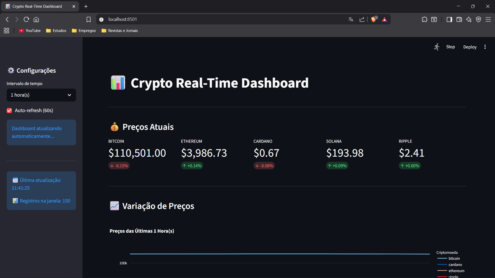
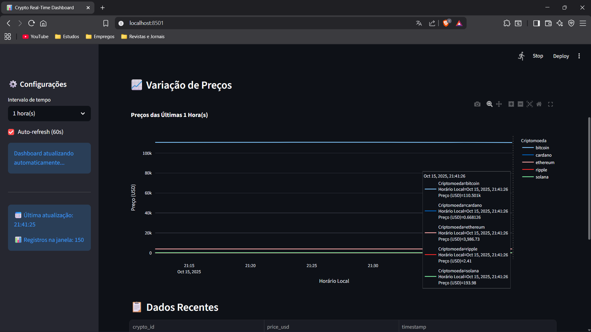
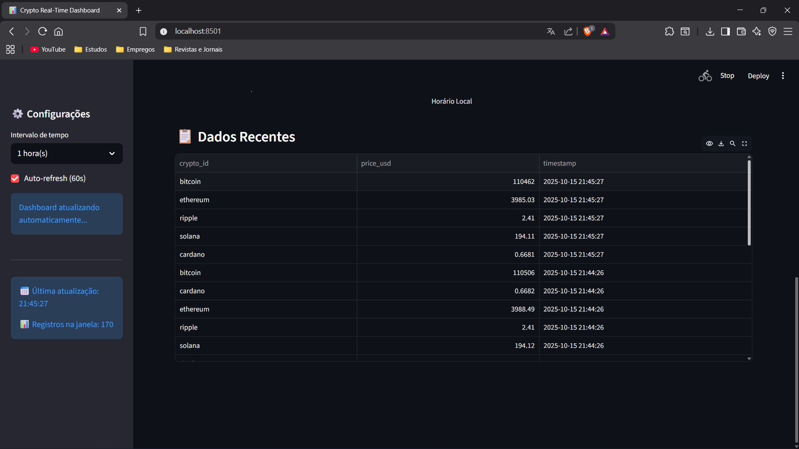

<a id="readme-top"></a>

<!-- LINKEDIN HEADER SHIELD -->

[![LinkedIn][linkedin-shield]][linkedin-url]

<!-- PROJECT INTRO -->
<br />
<div align="center">
  
  <h3 align="center">Crypto Monitor: Stream Processing em Tempo Real</h3>
  
  <p align="center">
    Um pipeline completo para monitorar preços de criptomoedas em tempo real utilizando Kafka, Streamlit e Docker!
    <br />
    <a href="https://youtu.be/QQNmT_7c4rI"><strong>Demonstração »</strong></a>
    <br />
    <br />
  </p>

</div>

<!-- TABELA DE CONTEÚDOS -->
<details>
  <summary>Tabela de conteúdos</summary>
  <ol>
    <li>
      <a href="#sobre-o-projeto">Sobre o projeto</a>
      <ul>
        <li><a href="#desenvolvido-com">Desenvolvido com</a></li>
      </ul>
    </li>
    <li>
      <a href="#como-usar">Como usar</a>
      <ul>
        <li><a href="#pré-requisitos">Pré-requisitos</a></li>
        <li><a href="#instalação">Instalação</a></li>
      </ul>
    </li>
    <li><a href="#exemplo-de-uso">Exemplo de uso</a></li>
    <li><a href="#contribuição">Contribuição</a></li>
    <li><a href="#licença">Licença</a></li>
    <li><a href="#contato">Contato</a></li>
  </ol>
</details>

<!-- SOBRE O PROJETO -->

## Sobre o Projeto

Este projeto é uma aplicação de monitoramento de preços de criptomoedas em tempo real, construída com uma arquitetura robusta de processamento de streams de dados. Ele demonstra a integração de várias tecnologias modernas para criar um pipeline completo:

- **Producer (`api.py`):** Coleta dados de preços da API CoinGecko.
- **Kafka:** Atua como um broker de mensagens, desacoplando o Producer do Consumer.
- **Consumer (`main.py`):** Consome as mensagens do Kafka, processa os dados e os persiste em um banco de dados SQLite.
- **SQLAlchemy:** ORM (Object-Relational Mapper) para interagir com o banco de dados.
- **Streamlit (`dashboard.py`):** Apresenta um dashboard interativo e em tempo real para visualização dos preços históricos e atuais das criptomoedas.
- **Docker Compose:** Orquestra todos os serviços (Kafka, Zookeeper, Producer, Consumer, Dashboard) para um ambiente de desenvolvimento e execução consistente e isolado.

O sistema captura dados como preço em USD e variação de 24 horas, armazena-os de forma persistente e os visualiza em uma interface amigável, com auto-refresh e conversão de fuso horário.

<p align="right">(<a href="#readme-top">back to top</a>)</p>

### Desenvolvido com

Este projeto foi desenvolvido com as seguintes tecnologias:

[![Python][python-shield]][python-url]
[![Kafka][kafka-shield]][kafka-url]
[![Docker][docker-shield]][docker-url]
[![Streamlit][streamlit-shield]][streamlit-url]
[![Pandas][pandas-shield]][pandas-url]
[![Requests][requests-shield]][requests-url]
[![SQLAlchemy][sqlalchemy-shield]][sqlalchemy-url]
[![Plotly][plotly-shield]][plotly-url]

<p align="right">(<a href="#readme-top">back to top</a>)</p>

<!-- COMO USAR -->

## Como usar

Siga os passos abaixo para configurar e executar o projeto localmente.

## 📚 Documentação

Para um tutorial detalhado sobre como o script funciona, consulte o arquivo [tutorial.py](tutorial.py).

### Pré-requisitos

Antes de tudo, certifique-se de ter o seguinte instalado:

- **Python 3.8+** (verifique com `python --version`)
- **Docker** e **Docker Compose** (para orquestrar os serviços).

### Instalação

**1. Clone este repositório:**

```bash
git clone https://github.com/Cabana021/real-time-crypto-monitor
cd real-time-crypto-monitor
```

**2. Crie o arquivo de configuração .env (opcional, para customização):**

Você pode criar um arquivo .env na raiz do projeto para sobrescrever as configurações padrão (como KAFKA_BOOTSTRAP_SERVERS, FETCH_INTERVAL, DATABASE_URL, etc.). Um exemplo básico:

```
# .env
# KAFKA_BOOTSTRAP_SERVERS=localhost:9092
# KAFKA_TOPIC=crypto-prices
# FETCH_INTERVAL=30
# DATABASE_URL=sqlite:///crypto_prices.db
```

Se não criar, as configurações padrão do config.py serão usadas.

**3. Instale as dependências Python:**

Embora a maioria das dependências seja gerenciada pelo Docker, é uma boa prática tê-las instaladas se for executar scripts fora dos contêineres ou para suporte de IDEs.

```bash
pip install -r requirements.txt
```

**4. Inicie o pipeline com Docker Compose:**

Este comando construirá as imagens Docker (se necessário) e iniciará todos os serviços definidos no docker-compose.yml (Zookeeper, Kafka, Producer, Consumer, Dashboard).

```
docker-compose up --build
```

**5. Acesse o Dashboard:**

Após todos os serviços iniciarem (pode levar alguns minutos para o Kafka estabilizar e o Producer/Consumer se conectarem), o Dashboard do Streamlit estará acessível em:

```
http://localhost:8501
```

Pressione **ENTER** e a automação iniciará o processo de análise e remoção das conexões.

<p align="right">(<a href="#readme-top">back to top</a>)</p>

<!-- EXEMPLO DE USO -->

## Exemplo de uso

Uma vez que o pipeline esteja em execução e o Dashboard acessível, você verá:

Logs do Producer (no terminal Docker):

```
crypto-producer | [HH:MM:SS] Buscando preços...
crypto-producer | 📤 Enviado: bitcoin = $X.XX
crypto-producer | 📤 Enviado: ethereum = $Y.YY
...
```

Logs do Consumer (no terminal Docker):

```
crypto-consumer | [HH:MM:SS] Mensagem recebida
crypto-consumer | 💾 Salvo: BITCOIN = $X.XX 📈 +A.BB%
crypto-consumer | ⚠️ ALERTA: ETHEREUM com variação de B.CC% nas últimas 24h!
...
```

**Dashboard Streamlit (no seu navegador):** Você verá um painel interativo exibindo:

- Preços atuais de cada criptomoeda com variação percentual.

- Um gráfico de linhas com a evolução histórica dos preços.

- Uma tabela com os dados mais recentes.

- Opções para selecionar o intervalo de tempo e ativar o auto-refresh.

📈 Tela principal



<p>A tela principal do dashboard oferece uma visão completa e centralizada do monitoramento. No topo, métricas exibem o preço atual e a variação percentual de cada criptomoeda. Logo abaixo, o gráfico de linhas mostra a tendência histórica, seguido por uma tabela com os dados mais recentes. A barra lateral à esquerda contém os controles de configuração, como o intervalo de tempo e a opção de auto-refresh.</p>

<p align="right">(<a href="#readme-top">back to top</a>)</p>

📈 Histórico de preço



<p>O gráfico de linhas interativo exibe a evolução histórica dos preços para cada criptomoeda monitorada. O usuário pode selecionar o intervalo de tempo na barra lateral (de 1 a 24 horas), e ao passar o mouse, detalhes como preço e horário são exibidos para todas as moedas simultaneamente, facilitando a comparação.</p>

<p align="right">(<a href="#readme-top">back to top</a>)</p>

📈 Tabela com alterações de preço



<p>A seção "Dados Recentes" apresenta uma tabela com os últimos registros de preço para cada criptomoeda, organizados em ordem cronológica decrescente. As colunas exibem a criptomoeda, o preço em USD e o timestamp formatado para fácil leitura, oferecendo uma visão detalhada dos dados mais atuais que foram persistidos no banco de dados..</p>

<p align="right">(<a href="#readme-top">back to top</a>)</p>

<!-- CONTRIBUIÇÃO -->

## Contribuição

Contribuições são o que tornam a comunidade open source um lugar incrível para aprender, inspirar e criar. Qualquer contribuição que você fizer será **muito bem-vinda**!

### Como contribuir?

1. Faça um Fork do projeto
2. Crie uma Branch para sua feature (`git checkout -b feature/MinhaFeature`)
3. Commit suas mudanças (`git commit -m 'Add: Minha nova feature'`)
4. Push para a Branch (`git push origin feature/MinhaFeature`)
5. Abra um Pull Request

### Ideias de melhorias

Algumas sugestões do que você pode contribuir:

- 🔧 Adicionar mais palavras-chave personalizáveis
- 📊 Criar relatórios em PDF ou CSV
- ⚙️ Implementar interface gráfica (GUI)
- 🌐 Suporte para outros idiomas
- 🛡️ Melhorias na segurança e tratamento de erros

### Encontrou um bug?

Abra uma [issue](https://github.com/Cabana021/automacao-linkedin/issues) descrevendo o problema, e vamos resolver juntos!

**Obrigado por ajudar a tornar este projeto ainda melhor!** ⭐

<p align="right">(<a href="#readme-top">back to top</a>)</p>

<!-- LICENÇA -->

## Licença

Este projeto está sob a licença **Unlicense** - isso significa que ele é de **domínio público** e você pode fazer o que quiser com ele!

Sinta-se livre para:

- ✅ Usar comercialmente
- ✅ Modificar e adaptar
- ✅ Distribuir
- ✅ Usar em projetos privados

**Sem nenhuma restrição ou necessidade de atribuição.**

<p align="right">(<a href="#readme-top">back to top</a>)</p>

<!-- CONTATO -->

## Contato

Criado por: **Victor Cabana**. Sinta-se à vontade para me contatar:

[![LinkedIn][linkedin-shield]][linkedin-url]

[![Email][email-shield]][email-url]

<p align="right">(<a href="#readme-top">back to top</a>)</p>

<!-- MARKDOWN LINKS & IMAGES -->

[linkedin-shield]: https://img.shields.io/badge/-LinkedIn-black.svg?style=for-the-badge&logo=linkedin&colorB=0077B5
[linkedin-url]: https://www.linkedin.com/in/victor-cabana-simoes/
[email-shield]: https://img.shields.io/badge/Email-D14836?style=for-the-badge&logo=gmail&logoColor=white
[email-url]: mailto:vcabanadev@gmail.com
[python-shield]: https://img.shields.io/badge/Python-3776AB?style=for-the-badge&logo=python&logoColor=white
[python-url]: https://www.python.org/
[kafka-shield]: https://img.shields.io/badge/Apache%20Kafka-232527?style=for-the-badge&logo=apachekafka&logoColor=white
[kafka-url]: https://kafka.apache.org/
[docker-shield]: https://img.shields.io/badge/Docker-2496ED?style=for-the-badge&logo=docker&logoColor=white
[docker-url]: https://www.docker.com/
[streamlit-shield]: https://img.shields.io/badge/Streamlit-FF4B4B?style=for-the-badge&logo=streamlit&logoColor=white
[streamlit-url]: https://streamlit.io/
[pandas-shield]: https://img.shields.io/badge/Pandas-150458?style=for-the-badge&logo=pandas&logoColor=white
[pandas-url]: https://pandas.pydata.org/
[requests-shield]: https://img.shields.io/badge/Requests-161617?style=for-the-badge
[requests-url]: https://requests.readthedocs.io/
[sqlalchemy-shield]: https://img.shields.io/badge/SQLAlchemy-3B3D3D?style=for-the-badge&logo=sqlalchemy&logoColor=white
[sqlalchemy-url]: https://www.sqlalchemy.org/
[plotly-shield]: https://img.shields.io/badge/Plotly-231F20?style=for-the-badge&logo=plotly&logoColor=white
[plotly-url]: https://plotly.com/
